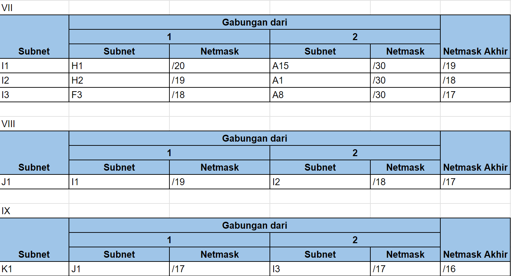

# Jarkom-Modul-4-IT04-2024

| Nama                             | NRP        |
| -------------------------------- | ---------- |
| Dionisius Marcell Putra Indranto | 5027231044 |
| Aswalia Novitriasari             | 5027231012 |

## Daftar Isi

- [Jarkom-Modul-4-IT24-2024](#jarkom-modul-4-it24-2024)
  - [Daftar Isi](#daftar-isi)
  - [Topologi](#topologi)
    - [Topologi GNS3 VLSM](#topologi-gns3-vlsm)
    - [Topologi CPT CIDR](#topologi-cpt-cidr)
  - [Routing Table](#routing-table)
  - [Subnetting GNS - Metode VLSM](#subnetting-gns--metode-vlsm)
  - [Subnetting CPT - Metode CIDR](#subnetting-cpt--metode-cidr)

## Topologi

#### Topologi GNS3 VLSM


#### Topologi CPT CIDR

## Routing Table

| Nama Subnet | Rute                                                                                            | Jumlah IP | Netmask |
| ----------- | ----------------------------------------------------------------------------------------------- | --------- | ------- |
| A1          | Hololive > HoloID                                                                               | 2         | /30     |
| A2          | Hololive > HoloID > AREA-15                                                                     | 2         | /30     |
| A3          | Hololive > HoloID > AREA-15 > Switch6 > Moona + Risu + lofi                                     | 661       | /22     |
| A4          | Hololive > HoloID > holoro                                                                      | 2         | /30     |
| A5          | Hololive > HoloID > holoro > Switch7 > Ollie + Anya + Reine                                     | 34        | /26     |
| A6          | Hololive > HoloID > holoh3ro                                                                    | 2         | /30     |
| A7          | Hololive > HoloID > holoh3ro > Switch8 > Zeta + Kaela + Kobo                                    | 299       | /23     |
| A8          | Hololive > HoloJP                                                                               | 2         | /30     |
| A9          | Hololive > HoloJP > Switch1 > DEV_IS + GEN:0                                                    | 3         | /29     |
| A10         | Hololive > HoloJP > Switch1 > DEV_IS > Re:Gloss > Ririka_Raden + Ao + Hajime_Kanade             | 14        | /28     |
| A11         | Hololive > HoloJP > Switch1 > GEN:0 > Switch3 > MiComet + Sora_Robo_AZK + GEN:1                 | 2045      | /21     |
| A12         | Hololive > HoloJP > Switch1 > GEN:0 > Switch3 > GEN:1 > Member > FBK_Matsuri + Aki_Hachama      | 470       | /23     |
| A13         | Hololive > HoloJP > Switch1 > GEN:0 > Switch3 > GEN:1 > GAMERS                                  | 2         | /30     |
| A14         | Hololive > HoloJP > Switch1 > GEN:0 > Switch3 > GEN:1 > GAMERS > Fubuki > Korone + Okayu + Mio  | 120       | /25     |
| A15         | Hololive > HoloEN                                                                               | 2         | /30     |
| A16         | Hololive > HoloEN > HoloAdvent                                                                  | 2         | /30     |
| A17         | Hololive > HoloEN > HoloAdvent > Switch0 > FuwaMoco + Shiori_Nerissa + Biboo                    | 28        | /27     |
| A18         | Hololive > HoloEN > Holo-Myth                                                                   | 2         | /30     |
| A19         | Hololive > HoloEN > Holo-Myth > Switch2 > Gura_Ame_Ina + Kiara_Calli                            | 503       | /23     |
| A20         | Hololive > HoloEN > Holo-Myth > HoloPromise > Project-Hope + Holo_Council                       | 3         | /29     |
| A21         | Hololive > HoloEN > Holo-Myth > HoloPromise > Project-Hope > Irys                               | 3         | /29     |
| A22         | Hololive > HoloEN > Holo-Myth > HoloPromise > Holo-Council > Switch4 > Kronii_Mumei + Bae_Fauna | 62        | /26     |
| Total       |                                                                                                 | 4263      | /19     |

## Subnetting GNS - Metode VLSM


## Subnetting CPT - Metode CIDR

### Tree CIDR


### Tree VLSM


### Pembagian IP VLSM


### Penggabungan Subnet




### Pembagian IP


### Konfigurasi Subnetting

#### Subnetting A1

**Hololive (Router)**

```
enable
configure terminal
interface fa0/0
ip address 192.235.160.1 255.255.255.252
no shutdown
```

**Holo-ID (Router)**

```
enable
configure terminal
interface fa0/0
ip address 192.235.160.2 255.255.255.252
no shutdown
```

#### Subnetting A2

**Holo-ID (Router)**

```
enable
configure terminal
interface fa0/1
ip address 192.235.192.1 255.255.255.252
no shutdown
```

**AREA15 (Router)**

```
enable
configure terminal
interface fa0/0
ip address 192.235.192.2 255.255.255.252
no shutdown
```

#### Subnetting A3

**AREA15 (Router)**

```
enable
configure terminal
interface fa0/1
ip address 192.235.128.1 255.255.252.0
no shutdown
```

**Moona (Device)**

```
Interface fa0
IP Address: 192.235.128.3
Subnet Mask: 255.255.252.0
Gateway: 192.235.128.1
```

**Risu (Device)**

```
Interface fa0
IP Address: 192.235.128.2
Subnet Mask: 255.255.252.0
Gateway: 192.235.128.1
```

**lofi (Device)**

```
Interface fa0
IP Address: 192.235.128.4
Subnet Mask: 255.255.252.0
Gateway: 192.235.128.1
```

#### Subnetting A4

**Holo-ID (Router)**

```
enable
configure terminal
interface fa1/0
ip address 192.235.136.65 255.255.255.252
no shutdown
```

**holoro (Router)**

```
enable
configure terminal
interface fa0/0
ip address 192.235.136.66 255.255.255.252
no shutdown
```

#### Subnetting A5

**holoro (Router)**

```
enable
configure terminal
interface fa0/1
ip address 192.235.136.1 255.255.255.192
no shutdown
```

**Ollie (Device)**

```
Interface fa0
IP Address: 192.235.136.2
Subnet Mask: 255.255.255.192
Gateway: 192.235.136.1
```

**Anya (Device)**

```
Interface fa0
IP Address: 192.235.136.3
Subnet Mask: 255.255.255.192
Gateway: 192.235.136.1
```

**Reine (Device)**

```
Interface fa0
IP Address: 192.235.136.4
Subnet Mask: 255.255.255.192
Gateway: 192.235.136.1
```

#### Subnetting A6

**Holo-ID (Router)**

```
enable
configure terminal
interface fa1/1
ip address 192.235.146.1 255.255.255.252
no shutdown
```

**holoh3ro (Router)**

```
enable
configure terminal
interface fa0/0
ip address 192.235.146.2 255.255.255.252
no shutdown
```

#### Subnetting A7

**holoh3ro (Router)**

```
enable
configure terminal
interface fa0/1
ip address 192.235.144.1 255.255.254.0
no shutdown
```

**Zeta (Device)**

```
Interface fa0
IP Address: 192.235.144.2
Subnet Mask: 255.255.254.0
Gateway: 192.235.144.1
```

**Kaela (Device)**

```
Interface fa0
IP Address: 192.235.144.3
Subnet Mask: 255.255.254.0
Gateway: 192.235.144.1
```

**Kobo (Device)**

```
Interface fa0
IP Address: 192.235.144.4
Subnet Mask: 255.255.254.0
Gateway: 192.235.144.1
```

#### Subnetting A8

**Hololive (Router)**

```
enable
configure terminal
interface fa1/1
ip address 192.235.64.1 255.255.255.252
no shutdown
```

**HoloJP (Router)**

```
enable
configure terminal
interface fa0/0
ip address 192.235.64.2 255.255.255.252
no shutdown
```

#### Subnetting A9

**HoloJP (Router)**

```
enable
configure terminal
interface fa0/1
ip address 192.235.32.1 255.255.255.248
no shutdown
```

**DEV_IS (Router)**

```
enable
configure terminal
interface fa0/0
ip address 192.235.32.2 255.255.255.248
no shutdown
```

**GEN:0 (Router)**

```
enable
configure terminal
interface fa0/0
ip address 192.235.32.3 255.255.255.248
no shutdown
```

#### Subnetting A10

**DEV_IS (Router)**

```
enable
configure terminal
interface fa0/1
ip address 192.235.16.1 255.255.255.240
no shutdown
```

**Ririka_Rade (Device)**

```
Interface fa0
IP Address: 192.235.16.2
Subnet Mask: 255.255.255.240
Gateway: 192.235.16.1
```

**Ao (Device)**

```
Interface fa0
IP Address: 192.235.16.2
Subnet Mask: 255.255.255.240
Gateway: 192.235.16.1
```

**Hajime_Kanade (Device)**

```
Interface fa0
IP Address: 192.235.16.3
Subnet Mask: 255.255.255.240
Gateway: 192.235.16.1
```

#### Subnetting A11

**GEN:0 (Router)**

```
enable
configure terminal
interface fa0/1
ip address 192.235.0.1 255.255.248.0
no shutdown
```

**GEN:1 (Router)**

```
enable
configure terminal
interface fa0/0
ip address 192.235.0.4 255.255.248.0
no shutdown
```

**MiComet (Device)**

```
Interface fa0
IP Address: 192.235.0.2
Subnet Mask: 255.255.248.0
Gateway: 192.235.0.1
```

**Sora_Robo_AZK (Device)**

```
Interface fa0
IP Address: 192.235.0.3
Subnet Mask: 255.255.248.0
Gateway: 192.235.0.1
```

#### Subnetting A12

**GEN:1 (Router)**

```
enable
configure terminal
interface fa0/1
ip address 192.235.8.1 255.255.254.0
no shutdown
```

**FBK_Matsuri (Device)**

```
Interface fa0
IP Address: 192.235.8.2
Subnet Mask: 255.255.254.0
Gateway: 192.235.8.1
```

**Aki_Hachama (Device)**

```
Interface fa0
IP Address: 192.235.8.3
Subnet Mask: 255.255.254.0
Gateway: 192.235.8.1
```

#### Subnetting A13

**GEN:1 (Router)**

```
enable
configure terminal
interface fa1/0
ip address 192.235.10.129 255.255.255.252
no shutdown
```

**GAMERS (Router)**

```
enable
configure terminal
interface fa0/0
ip address 192.235.10.130 255.255.255.252
no shutdown
```

#### Subnetting A14

**GAMERS (Router)**

```
enable
configure terminal
interface fa0/1
ip address 192.235.10.1 255.255.255.128
no shutdown
```

**Kerone (Device)**

```
Interface fa0
IP Address: 192.235.10.2
Subnet Mask: 255.255.255.128
Gateway: 192.235.10.1
```

**Okayu (Device)**

```
Interface fa0
IP Address: 192.235.10.3
Subnet Mask: 255.255.255.128
Gateway: 192.235.10.1
```

**Mio (Device)**

```
Interface fa0
IP Address: 192.235.10.4
Subnet Mask: 255.255.255.128
Gateway: 192.235.10.1
```

#### Subnetting A15

**Hololive (Router)**

```
enable
configure terminal
interface fa0/1
ip address 192.235.208.1 255.255.255.252
no shutdown
```

**HoloEN (Router)**

```
enable
configure terminal
interface fa0/0
ip address 192.235.208.2 255.255.255.252
no shutdown
```

#### Subnetting A16

**HoloEN (Router)**

```
enable
configure terminal
interface fa1/0
ip address 192.235.200.33 255.255.255.252
no shutdown
```

**HoloAdvent (Router)**

```
enable
configure terminal
interface fa0/0
ip address 192.235.200.34 255.255.255.252
no shutdown
```

#### Subnetting A17

**HoloAdvent (Router)**

```
enable
configure terminal
interface fa0/1
ip address 192.235.200.1 255.255.255.224
no shutdown
```

**FuwaMoco (Device)**

```
Interface fa0
IP Address: 192.235.200.2
Subnet Mask: 255.255.224.0
Gateway: 192.235.200.1
```

**Shiori_Nerissa (Device)**

```
Interface fa0
IP Address: 192.235.200.3
Subnet Mask: 255.255.224.0
Gateway: 192.235.200.1
```

**Biboo (Device)**

```
Interface fa0
IP Address: 192.235.200.4
Subnet Mask: 255.255.224.0
Gateway: 192.235.200.1
```

#### Subnetting A18

**HoloEN (Router)**

```
enable
configure terminal
interface fa0/1
ip address 192.235.196.1 255.255.255.252
no shutdown
```

**Holo-Myth (Router)**

```
enable
configure terminal
interface fa0/0
ip address 192.235.196.2 255.255.255.252
no shutdown
```

#### Subnetting A19

**Holo-Myth (Router)**

```
enable
configure terminal
interface fa0/1
ip address 192.235.192.1 255.255.254.0
no shutdown
```

**Gura_Ame_Ina (Device)**

```
Interface fa0
IP Address: 192.235.192.2
Subnet Mask: 255.255.254.0
Gateway: 192.235.192.1
```

**Kiara_Calli (Device)**

```
Interface fa0
IP Address: 192.235.192.3
Subnet Mask: 255.255.254.0
Gateway: 192.235.192.1
```

#### Subnetting A20

**Holo-Myth (Router)**

```
enable
configure terminal
interface fa1/0
ip address 192.235.194.129 255.255.255.248
no shutdown
```

**Project-Hope (Router)**

```
enable
configure terminal
interface fa0/0
ip address 192.235.194.130 255.255.255.248
no shutdown
```

**Holo-Council (Router)**

```
enable
configure terminal
interface fa0/0
ip address 192.235.194.131 255.255.255.248
no shutdown
```

#### Subnetting A21

**Project-Hope (Router)**

```
enable
configure terminal
interface fa0/1
ip address 192.235.194.65 255.255.255.248
no shutdown
```

**Irys (Device)**

```
Interface fa0
IP Address: 192.235.194.66
Subnet Mask: 255.255.255.248
Gateway: 192.235.194.65
```

#### Subnetting A22

**Holo-Council (Router)**

```
enable
configure terminal
interface fa0/1
ip address 192.235.194.1 255.255.255.192
no shutdown
```

**Kronii_Mumei (Device)**

```
Interface fa0
IP Address: 192.235.194.2
Subnet Mask: 255.255.255.192
Gateway: 192.235.194.1
```

**Bae_Fauna (Device)**

```
Interface fa0
IP Address: 192.235.194.3
Subnet Mask: 255.255.255.192
Gateway: 192.235.194.1
```

### Routing

#### Sisi Kanan (Holo-ID)

##### Hololive

```
enable
configure terminal
ip route 192.235.192.0 255.255.255.252 192.235.160.2
ip route 192.235.128.0 255.255.252.0 192.235.160.2
ip route 192.235.136.64 255.255.255.252 192.235.160.2
ip route 192.235.136.0 255.255.255.192 192.235.160.2
ip route 192.235.146.0 255.255.255.252 192.235.160.2
ip route 192.235.144.0 255.255.254.0 192.235.160.2
do write
```

##### Holo-ID

```
enable
configure terminal
ip route 0.0.0.0 0.0.0.0 192.235.160.1
ip route 192.235.128.0 255.255.252.0 192.235.192.2
ip route 192.235.136.0 255.255.255.192 192.235.136.66
ip route 192.235.144.0 255.255.254.0 192.235.146.2
do write
```

##### AREA15

```
enable
configure terminal
ip route 0.0.0.0 0.0.0.0 192.235.192.1
do write
```

##### holoro

```
enable
configure terminal
ip route 0.0.0.0 0.0.0.0 192.235.136.65
do write
```

##### holoh3ro

```
enable
configure terminal
ip route 0.0.0.0 0.0.0.0 192.235.146.1
do write
```

#### Sisi Bawah (HoloJP)

##### Hololive

```
enable
configure terminal
ip route 192.235.32.0 255.255.255.248 192.235.64.2
ip route 192.235.16.0 255.255.255.240 192.235.64.2
ip route 192.235.0.0 255.255.248.0 192.235.64.2
ip route 192.235.8.0 255.255.254.0 192.235.64.2
ip route 192.235.10.128 255.255.255.252 192.235.64.2
ip route 192.235.10.0 255.255.255.128 192.235.64.2
do write
```

##### HoloJP

```
enable
configure terminal
ip route 0.0.0.0 0.0.0.0 192.235.64.1
ip route 192.235.16.0 255.255.255.240 192.235.32.2
ip route 192.235.0.0 255.255.248.0 192.235.32.3
ip route 192.235.8.0 255.255.254.0 192.235.32.3
ip route 192.235.10.128 255.255.255.252 192.235.32.3
ip route 192.235.10.0 255.255.255.128 192.235.32.3
do write
```

##### DEV_IS

```
enable
configure terminal
ip route 0.0.0.0 0.0.0.0 192.235.32.1
ip route 192.235.0.0 255.255.248.0 192.235.32.3
ip route 192.235.8.0 255.255.254.0 192.235.32.3
ip route 192.235.10.128 255.255.255.252 192.235.32.3
ip route 192.235.10.0 255.255.255.128 192.235.32.3
do write
```

##### GEN:0

```
enable
configure terminal
ip route 0.0.0.0 0.0.0.0 192.235.32.1
ip route 192.235.16.0 255.255.255.240 192.235.32.2
ip route 192.235.8.0 255.255.254.0 192.235.0.4
ip route 192.235.10.128 255.255.255.252 192.235.0.4
ip route 192.235.10.0 255.255.255.128 192.235.0.4
do write
```

##### GEN:1

```
enable
configure terminal
ip route 0.0.0.0 0.0.0.0 192.235.0.1
ip route 192.235.10.0 255.255.255.128 192.235.10.130
do write
```

##### GAMERS

```
enable
configure terminal
ip route 0.0.0.0 0.0.0.0 192.235.10.129
do write
```

#### Sisi Kiri (HoloEN)

##### Hololive

```
enable
configure terminal
ip route 192.235.200.32 255.255.255.252 192.235.208.2
ip route 192.235.200.0 255.255.255.224 192.235.208.2
ip route 192.235.196.0 255.255.255.252 192.235.208.2
ip route 192.235.192.0 255.255.254.0 192.235.208.2
ip route 192.235.194.128 255.255.255.248 192.235.208.2
ip route 192.235.194.64 255.255.255.248 192.235.208.2
ip route 192.235.194.0 255.255.255.192 192.235.208.2
do write
```

##### HoloEN

```
enable
configure terminal
ip route 0.0.0.0 0.0.0.0 192.235.208.1
ip route 192.235.200.0 255.255.255.224 192.235.200.1
ip route 192.235.192.0 255.255.254.0 192.235.196.2
ip route 192.235.194.128 255.255.255.248 192.235.196.2
ip route 192.235.194.64 255.255.255.248 192.235.196.2
ip route 192.235.194.0 255.255.255.192 192.235.196.2
do write
```

##### HoloAdvent

```
enable
configure terminal
ip route 0.0.0.0 0.0.0.0 192.235.200.33
do write
```

##### Holo-Myth

```
enable
configure terminal
ip route 0.0.0.0 0.0.0.0 192.235.196.1
ip route 192.235.194.64 255.255.255.248 192.235.194.130
ip route 192.235.194.0 255.255.255.192 192.235.194.131
do write
```

##### Project-Hope

```
enable
configure terminal
ip route 0.0.0.0 0.0.0.0 192.235.194.129
ip route 192.235.194.0 255.255.255.192 192.235.194.131
do write
```

##### Holo-Council

```
enable
configure terminal
ip route 0.0.0.0 0.0.0.0 192.235.194.129
ip route 192.235.194.64 255.255.255.248 192.235.194.130
do write
```
### Konfigurasi VLSM
#### Hololive
```
auto lo
iface lo inet loopback

auto eth0
iface eth0 inet dhcp

# A1 > HoloID
auto eth1
iface eth1 inet static
    address 192.235.19.72
    netmask 255.255.255.252

# A8 > HoloJP
auto eth2
iface eth2 inet static
    address 192.235.19.88
    netmask 255.255.255.252

# A15 > HoloEN
auto eth3
iface eth3 inet static
    address 192.235.19.96
    netmask 255.255.255.252
```
#### HoloID
```
# A1 > Hololive
auto eth0
iface eth0 inet static
    address 192.235.19.72
    netmask 255.255.255.252
    gateway 192.239.19.73

# A2 > Holoro
auto eth1
iface eth1 inet static
    address 192.235.19.76
    netmask 255.255.255.252

# A4 > Area15
auto eth2
iface eth2 inet static
    address 192.235.19.80
    netmask 255.255.255.252

# A6 > Holoh3ro
auto eth3
iface eth3 inet static
    address 192.235.19.84
    netmask 255.255.255.252
```
